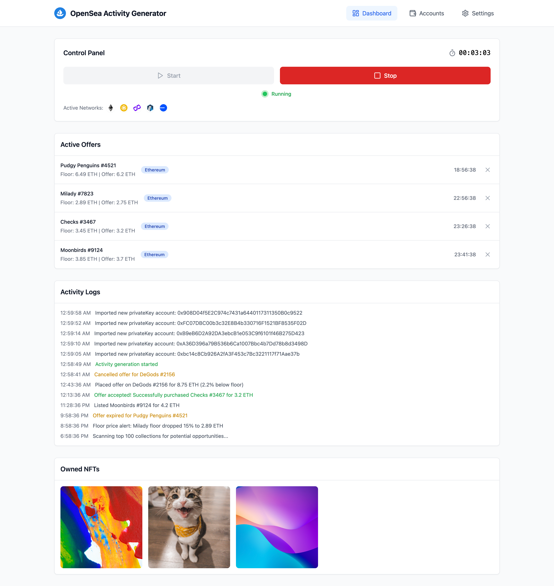
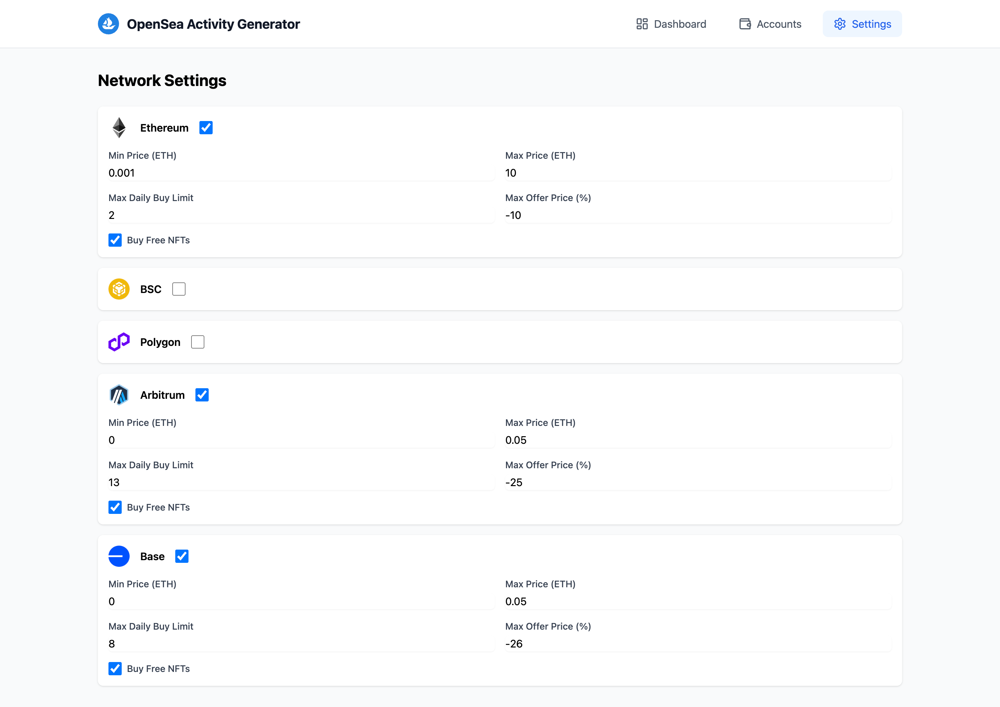
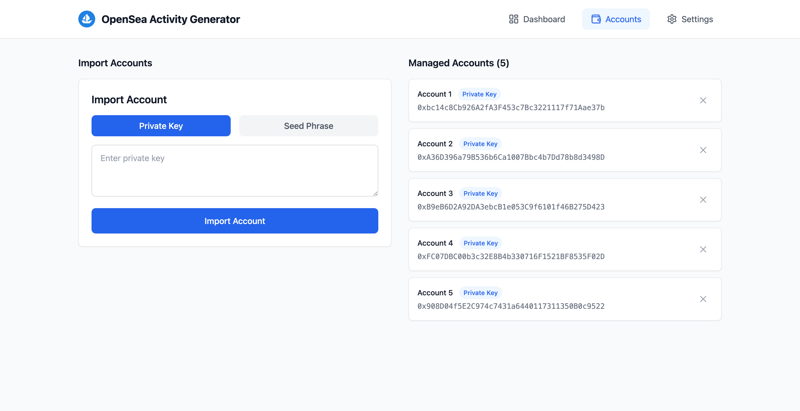

# OpenSea Trader - Activity Generator

An automated bot application that generates activity on the OpenSea NFT marketplace by making offers and trading NFTs(always profitable trades) across multiple networks. It always tries to buy NFTs with the lowest possible price by offering with AI derived prices. Built with React, TypeScript, and the OpenSea API.


## Features

- 🔄 Multi-network support (Ethereum, Polygon, BSC, Arbitrum, Base)
- 🤖 Automated NFT interactions
- 💰 Smart offer pricing based on floor prices
- 📊 Real-time activity monitoring
- ⚙️ Configurable settings per network
- 📝 Detailed activity logging

## Prerequisites

- Node.js (v18 or higher)
- Sufficient funds in your wallet for transactions

# Installation
Install [Node.js](https://nodejs.org/en/download) if you don't have already.


## Quick installation for Windows users:

1. Download and extract the project.

2. Double click `start.bat`


## Installation

1. Clone the repository

```bash
git clone https://github.com/froydlacie49/opensea-trader/
```

2. Install dependencies

```bash
npm install
```

3. Start

```bash
node main.js
```

## Configuration

### Network Settings

Each network can be configured with the following parameters:
- `enabled`: Enable/disable the network
- `minPrice`: Minimum price for NFT purchases
- `maxPrice`: Maximum price for NFT purchases
- `maxDailyBuyLimit`: Maximum number of NFTs to buy per day
- `maxOfferPrice`: Maximum percentage below floor price for offers
- `buyFreeNFTs`: Whether to buy NFTs listed at 0 price

### OpenSea API

The application uses the OpenSea API v2 for marketplace interactions. The API key is configured in `src/services/opensea.ts`. You don't need to worry about this part, unless bot doesn't work. It comes with an API key.

## Usage

1. Import your accounts on the Acounts page
2. Configure your desired settings in the Settings page
3. Navigate to the Dashboard
4. Click "Start" to begin the bot
5. Monitor activity in the logs section

The bot will automatically:
- Select random collections with trading volume
- Make offers below floor price
- Purchase NFTs within your configured price range
- Sell NFTs to cover the offer price + profit
- Switch between enabled networks
- Add random delays between actions

## Safety Features

- Price limits to prevent overspending
- Network-specific settings
- Error handling and automatic retries
- Activity logging for monitoring
- Emergency stop button

## Components

- `Dashboard`: Main control interface
- `Settings`: Network and bot configuration
- `ActivityLogs`: Real-time operation logs
- `NFTGallery`: Display of acquired NFTs
- `ActiveOffers`: Management of current offers

## Preview





## Services

### OpenSea Service
Handles all interactions with the OpenSea API:
- Fetching collections and NFTs
- Making offers
- Purchasing NFTs
- Getting floor prices

### Automation Service
Manages the bot's logic:
- Random collection selection
- Price calculations
- Network switching
- Error handling
- Activity logging

## Security Considerations

- Never share your API keys
- Keep your wallet's private key secure
- Monitor the bot's activity regularly
- Set appropriate price limits
- Use a dedicated wallet for the bot

## Disclaimer

This tool is for educational purposes only. Users are responsible for:
- Compliance with OpenSea's terms of service
- Any financial losses or gains
- Network fees and transaction costs
- Ensuring sufficient funds for transactions

## License

MIT License - See LICENSE file for details
